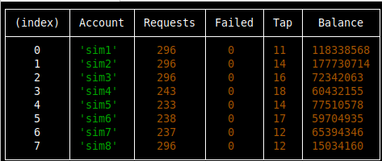

# HamsterBOT

## Overview

HamsterBOT is a bot designed to automate specific tasks using hamster accounts. This readme will guide you through the steps to install Node.js, clone the repository, install the necessary dependencies, configure the bot, and run it.

## Prerequisites

Before you start, ensure you have the following installed on your machine:

- [Git](https://git-scm.com/)
- [Node.js](https://nodejs.org/)

## Installation Guide

### Step 1: Install Node.js
install from from the [official website](https://nodejs.org/).


### Step 2: Clone the Repository

1. Open your terminal or command prompt.
2. Clone the repository using the SSH link:
   ```bash
   git clone git@github.com:maanimis/hamsterBOT.git
3. Change directory to the cloned repository:
    ```bash
    cd hamsterBOT


### Step 3: Install Dependencies

Install the required dependencies by running:
    ```npm install```


### Step 4: Edit Configuration

1. Open the `config/production.json` file in a text editor.
2. Edit the configuration settings as needed. For example, you might need to update API keys, account information, and other settings relevant to your environment.

### Step 5: Run the Bot

Start the bot by running:
    ```npm start```



